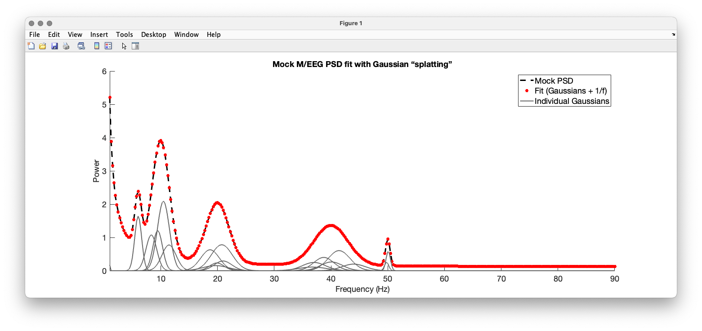

# FitPSDGaussianSplat

**Gaussian–splat style fitting for neurophysiological power spectra (M/EEG).**  
Decomposes a 1D PSD into a **sum of Gaussians (oscillatory peaks)** plus an **aperiodic 1/f background**, with a stable log-domain loss, pruning, and optional re-optimisation.



> Why “splat”? We borrow the philosophy from **Gaussian Splatting** (lots of small, differentiable blobs + fast compositing), adapted to **1D spectra**: many parametric Gaussians are “splatted” onto the frequency axis and jointly optimised.

---

## Features

- Fits **K** Gaussians (centres, widths, amplitudes) + **1/f^χ + b** background  
- Stable optimisation via **Adam** with softplus/sigmoid reparameterisations  
- **Log-power** loss option for PSDs spanning orders of magnitude  
- **Automatic pruning** of negligible components (energy-share threshold)  
- Simple API and demo with realistic **M/EEG-like mock data**  
- Works with SPM/FieldTrip style frequency vectors (e.g., `1:0.25:90` Hz)

---

## Quick Start

### Requirements
- MATLAB R2020a+ (tested on R2022–R2024)

### Clone
```bash
git clone https://github.com/alexandershaw4/FitPSDGaussianSplat.git
cd FitPSDGaussianSplat
```

### Run the demo
```matlab
addpath(genpath(pwd));
demo_mock_psd_fit
```

The demo:
1) builds a mock PSD on `w = 1:1/4:90`,  
2) fits it with `fit_psd_gaussian_splat`,  
3) reconstructs with `reconstruct_psd`,  
4) produces the plot (and `fits.png`).

---

## Minimal Usage

```matlab
% f: [N x 1] increasing Hz vector (e.g., (1:0.25:90)')
% S: [N x 1] PSD (linear power). Tiny negatives will be clamped inside.

opts = struct('use_log_power', true, ...  % log-domain loss, linear outputs
              'K0', 30, ...
              'sigma_init_hz', 0.8, ...
              'max_iter', 1000, ...
              'prune_frac', 0.01, ...
              'reopt_after_prune', true);

Fit = fit_psd_gaussian_splat(f, S, opts);

% Reconstruct on the same or a new grid:
[S_hat, S_bg, S_peaks] = reconstruct_psd(Fit, f);

% Plot
figure('Color','w'); hold on;
plot(f, S, 'k', 'LineWidth', 3);
plot(f, S_hat, 'r', 'LineWidth', 2.5);
plot(f, S_peaks, 'Color', [0.4 0.4 0.4], 'LineWidth', 2);
xlim([f(1) f(end)]);
xlabel('Frequency (Hz)'); ylabel('Power');
legend('PSD','Fit (Gaussians + 1/f)','Individual Gaussians');
title('PSD fit with Gaussian “splatting”');
```

### SPM DCM example
```matlab
f = DCM.xY.Hz(:);
S = DCM.xY.y{1}(:);             % first channel/condition PSD
Fit = fit_psd_gaussian_splat(f, S, struct('use_log_power', true));
[S_hat, ~, ~] = reconstruct_psd(Fit, f);
```

---

## Function Reference

### `Fit = fit_psd_gaussian_splat(f, S, opts)`
Decompose PSD into Gaussians + 1/f background.

**Inputs**
- `f` — `[N x 1]` strictly increasing frequencies (Hz, >0)  
- `S` — `[N x 1]` linear power spectrum  
- `opts` (optional struct)
  - `use_log_power` *(false)*: use `log(1+·)` loss
  - `K0` *(min(50, max(5, floor(numel(f)/10))))*: initial number of components
  - `max_iter` *(800–1000 typical)*
  - `lr` *(0.05)*, `beta1` *(0.9)*, `beta2` *(0.999)*, `eps_hat` *(1e-8)*
  - `sigma_init_hz` *(0.5–1.0 typical)*
  - `prune_frac` *(0.01)*: keep components ≥1% of peak energy
  - `reopt_after_prune` *(true)*, `reopt_iter` *(200)*
  - `seed` *(42)*

**Outputs** (`Fit` struct)
- `mu` `[K x 1]` — peak centres (Hz)  
- `sigma` `[K x 1]` — peak widths (Hz)  
- `A` `[K x 1]` — peak amplitudes  
- `bg` struct: `c` (scale ≥0), `chi` (slope ≥0), `b` (offset ≥0)  
- `S_hat` `[N x 1]` — reconstructed PSD (linear power)  
- `S_bg` `[N x 1]` — background alone  
- `S_peaks` `[N x K]` — per-Gaussian contributions  
- `keep_idx` — surviving component indices post-prune  
- `history` — loss over iterations  
- `opts` — resolved options snapshot

---

### `[S_hat, S_bg, S_peaks] = reconstruct_psd(Fit, f)`
Rebuild a PSD from `Fit` onto any frequency vector `f`.

- `S_hat = S_bg + sum(S_peaks, 2)`
- Use for resampling or producing publication figures.

---

## Tips

- For M/EEG spectra, **`use_log_power=true`** often yields better fits across θ–γ.  
- FWHM ≈ `2.355 * sigma` (Hz).  
- If optimisation stalls, try smaller `lr` (e.g., `0.02`) or increase `max_iter`.  
- If too many micro-peaks remain, raise `prune_frac` (e.g., `0.02–0.05`).  
- Clamp/denoise inputs: `S = max(S, 0);` is fine; the loss handles the rest.

---

## Roadmap

- Whittle/χ²-weighted loss options  
- Peak linking/constraints across subjects/conditions  
- Mixture backgrounds (e.g., pink + white: `c1 f^{-χ} + c2 f^{-1} + b`)  
- GPU acceleration (arrayfun)  
- Peak summary util (μ, FWHM, A, area)

---

## Citation / Inspiration

This 1D fitting approach is inspired by the compositing philosophy of **Gaussian Splatting** for radiance fields, reimagined for PSDs (not a renderer; no occlusion/projection). If you use this in a paper, please cite this repository; optionally cite Gaussian Splatting work for conceptual inspiration.

---

## License

MIT — see `LICENSE`.

---

## Contact

Issues and PRs welcome.  
Maintainer: **Alexander D. Shaw** (University of Exeter) — CPNS Lab
